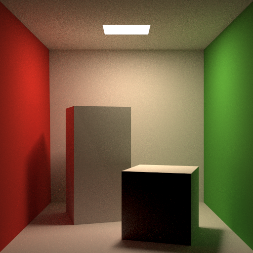

# Project Write Up

#### **This is a personal project implementing a ray tracer**

## Brief Introduction
This project implements a ray tracer from scratch. The reason why I gave up using the starter code in Homework3 lies on that OpenGL is basically a rasterizer and not so good for building ray tracer (although it can). Also, I want to implement some optimized features to speed up rendering (for example, building BVH). Therefore, I rewrite this renderer. 

This renderer aims to have the following features:
- Bounding volume hierachy (both naive method and SAH method)
- Multiple samples anti-aliasing
- Positionable camera
- Surface Light 
- Diffuse bounce with uniformally distributed sampling and cosine weighted hemisphere sampling
- Monte Carlo path tracing
- Stop path tracing with Russian Roulette
- Parallel rendering with CPU (OpenMP)


## Code Explanatoin
This part is the code document for describing how each module works and relative maths and algorithms.

### Ray
#### Define ray
Mathematically, a ray is 
$$R(t) = A + t \vec{d} (t > 0)$$
A is the origin, t is the length of direction vector.
Therefore, define a ```ray``` class like this:
```cpp
struct Ray{
    //Destination = origin + t*direction
    Vector3f origin;
    Vector3f direction, direction_inv;
    double t;
};
```
Notice that there is also a ```direction_inv``` which is (1/directioin.x, 1/directioin.y, 1/direction.z). The reason for defining this is to speed up the AABB hit method afterwards.

### Scene
Define the scene of the world. It has the following methods and parameters:
- Frame(image) paramters: width / height
- Camera paramters: imageAspectRatio / fovy / eyePos / target / vup
- Cast ray to the viewport
- Add objects (meshTriangle, sphere, ect..) to scene and build BVH
- Calculate the intersections with objects in the scene
- Sample lights
- Shade color
#### Casting ray to viewport
The viewport (aka screen) coordinate ranges from x[-1, 1] and y[-1, 1]. 
Given the imageAspectRatio and fovy, then 
$$viewportHeight = tan(\frac{fovy}{2}) * 2$$
$$viewportWidth = imageAspectRatio * viewportHeight$$
For pixel in (i, j), the center coordinate is 
$$x = 2 *\frac{i + 0.5}{2} - 1, y = 1 - \frac{i + 0.5}{2}$$

Given the eyePos, target, and vup vector, calculate 


$$w = normalize(eyePos - target), u = normalize(cross(vup, w)), v = normalize(cross(w, u))$$

then the ray direction is 
$$normalize(x * viewportWidth * u + y * viewportHeight * v - w)$$

#### Mutiple samples Anti-aliasing
Sample the pixel multiple times and average the result by the end. For each ray in a single pixel, send it to different points near the center by adding a random float (range from 0 - 1) to the center coordinate. 


Now the ray's target coordinate is:
$$x = 2 *\frac{i + randomFloat }{2} - 1, y = 1 - \frac{i + randomFloat}{2}$$

### Bounding Volume Hierachy

If calculate the intersection for every single object, the time cost will be linear to the number of objects, which is the main time-bottleneck. Therefore, before doing the ray intersection part, build a BVH to speed up the procedure. 

#### Intersect with Axis-aligned Bounding Boxes (AABB)

Rather than intersect a ray with privimitive objects, intersect with bounding boxes is simpler. AABB is just the intersection of 3 axis-aliigned intervals. For a ray hit a box, first figure out whether the ray hits the plane intervals. 


If only consider x coordinates, let $t_{min}$ represents the time when the ray enters the left-side plane $x = x_0$ and  $t_{max}$ represents the time when the ray exits the right-side plane $x = x_1$. For a given ray $R(t) = A + tb$

$$t_{min} = \frac{x_0 - A_x}{b_x}, t_{max} = \frac{x_1 - A_x}{b_x}$$

For 3 dimenstions, $t_{enter} = max(t_{xmin}, t_{ymin}, t_{zmin}). t_{exit} = min(t_{xmax}, t_{ymax}, t_{zmax})$

Notice that both t_min and t_max can be negative, which means that the ray'sorigin is inside of the box or the ray does not enter the box. Therefore, if a ray hits the box, it needs to satisfy $t_{enter} <= t_{exit}$ and $t_{exit} >= 0$

#### Construct Bounding Boxes for Primitives

Two vectors (points) can specify a bounding box, a point pMin which represents the lower left corner and the other pMax represents the upper right corner. For each primitives, it has its own method to calculate the bouding box. For example, the bounding box of sphere is represented by 

$$pMin = center - (r, r, r), pMax = center + (r, r, r)$$

And for a triangle, 

$$pMin = min(x_1, x_2, x_3), min(y_1, y_2, y_3), min(z_1, z_2, z_3), pMin = max(x_1, x_2, x_3), max(y_1, y_2, y_3), max(z_1, z_2, z_3)$$

Creating a bounding box from 2 boxes by union is just update the pMin and pMax: 

 $$pMin = min(pMin1, pMin2), pMax = max(pMax1, pMax2)$$

#### Construct Bounding Volume Hierachy for Object List

The main idea of constructing BVH is building a tree whose nodes contain the bounding boxes recursively.  Choose the max-extent axis from x/y/z, sort the primitives, and put half of them into left/right subtree. The leaf nodes only conatin one bounding box. 

#### Optimization: SAH based BVH

A bounding box hierarchy based on the Surface Area Heuristic (SAH) is a way of organizing bounding boxes in a tree-like structure such that the overall cost of searching the tree for a particular object is minimized. The SAH uses the surface area of the bounding boxes to determine how they should be arranged in the hierarchy. Bounding boxes with smaller surface areas are placed closer to the leaves of the tree, while bounding boxes with larger surface areas are placed closer to the root of the tree. This arrangement allows for efficient searching, as the search can be quickly pruned once a bounding box with a small enough surface area is found.

#### Intersect with BHV

Getting the intersection with BHV is also a similar recursive functions: first check wether the ray hit the parent node, if yes, recursivily check with the left and right children nodes. If this node is a leaf node, intersect the ray with the primitive object inside this node. Each object implements its ```getintersection``` method

Intersection with sphere is the same as wriiten in slide (solveQuadratic). Intersection with triangle using the Moller Trumbore Intersection algorithm. This algorithm takes the advantage of barycentric coordinates and uses it to represent the intersection coordinate. Reference to this [wikipedia](https://en.wikipedia.org/wiki/M%C3%B6ller%E2%80%93Trumbore_intersection_algorithm#:~:text=The%20M%C3%B6ller%E2%80%93Trumbore%20ray%2Dtriangle,the%20plane%20containing%20the%20triangle.)

if the intersection P is in triangle(A, B, C), then

$$ P= O + tD = wA + uB + cV = (1 - u - v) + uB + vC = A + u(B-A) + v(C-A) $$
$$ \begin{bmatrix}
-D & (B - A) & (C-A) \\
\end{bmatrix} 
\begin{bmatrix}
t \\
u \\
v
\end{bmatrix} = 
O - A $$

$$\begin{bmatrix}
-D & (B - A) & (C-A) \\
\end{bmatrix} = \frac{1}{\vec{S_1}\vec{E_1}}
\begin{bmatrix}
\vec{S_2} \vec{E_2} \\
\vec{S_1} \vec{S} \\
\vec{S_2} \vec{D} 
\end{bmatrix} $$
where 
$$ \vec{E_1} = \vec{P_1} - \vec{P_0} $$
$$ \vec{E_2} = \vec{P_2} - \vec{P_0} $$
$$ \vec{S} = \vec{O} - \vec{P_0} $$
$$\vec{S_1} = \vec{D} - \vec{E_2} $$
$$ \vec{S_2} = \vec{S} \times \vec{E_1} $$

### Intersection

Intersection needs to contain the information

-  the oordinate of the intersected point
- the material of the intersected object
- the normal of that surface
- the distance from the ray origin and the intersection

### Object

The object class need to define the following functions:

- getIntersection (mentioned above)
- getBounds (mentioned above)
- getArea: calculate the area of primitive for surface sampling
- Sample: randomly choose a point on the surface and return the coordination and pdf of that point
- hasEmit: return its material emitable or not

For triangle and sphere, these implematations are intuitively. For MeshTriangle object, it would become a bit more complex.

For each meshTriangle, it needs to build up a bvh for triangle pritimives inside it. Therefore, a Sample function to randomly select a point in a bvh tree also is needed (still, it's a recursive method)

### Material

Material is now support for diffuse material. It's initialized with emission and color (albedo)

Functions in meterial class will be discussed below.  

### Shader

#### Global illumination

Global illumination combine direct illumination and indirect illumniation. The light rays that bounce only once from the surface of an object to reach an eye are direct illumination. Otherwise, rays bounce multiple time before reaching the eye are indirect illumination. Simulation of indirection illumination using done by backward tracing (simulating the light paths from receiver's eye to the light source).

#### Rendering equation

$$L_r(\vec{x}, \vec{\omega_r}) = \int_{\Omega_i}^{}f_r(\vec{x}, \vec{\omega_i}\rightarrow \vec{\omega_r}) L_i(\vec{x}, \vec{\omega_i}) cos\theta_id\omega_i $$

The color of the object depends on its reflected radiance. Given a point $x$ on a receiving surface, the reflected radiance $L_r$ is computed by integrating the incoming radiance $L_i$ over a hemisphere centered at the point of the surface and oriented its north pole aligned with the surface normal. The $f_r(\vec{x}, \vec{\omega_i}\rightarrow \vec{\omega_r})$ is the BRDF which is the proportion of the incoming radiance from $\omega_i$ is scattered outwared to $\omega_r$ 


#### Monte Carlo 

Monte Carlo Integration is used to evaluate the approximation of a definite integrals using random numbers.

$$F^N = \frac{1}{N} \sum_{i=1}^{N-1}\frac{f(Xi)}{pdf(X_i)}$$

$pdf$ stands for the probability density function of random variable $X_i$

To compute the reflected $L_r$  and solve the integration of incoming $L_i$, use Monte Carlo integration for approximation. 

$$L_r(\vec{x}, \vec{\omega_r}) = \frac{1}{N}\sum_{i=1}^{N-1} \frac{f_r(\vec{x}, \vec{\omega_i}\rightarrow \vec{\omega_r}) L_i(\vec{x}, \vec{\omega_i}) cos\theta_i}{pdf(\omega_i)} $$


#### Path tracing

From a high level aspect, the path tracing combines of two tasks: shooting rays from eye, for a given point x on the surface and a incoming ray $\omega_r$ (notice that it's a back tracing), calculate 1) its direct illumination and 2) its indirect illumination.

For direct illumination (which means the scatter ray $\omega_i$ on this point would hit the light source)
$$L_r(\vec{x}, \vec{\omega_r}) = \frac{f_r(\vec{x}, \vec{\omega_i}\rightarrow \vec{\omega_r}) L_i(\vec{x}, \vec{\omega_i}) cos\theta_i}{pdf(\omega_i)} $$

(The difference between the equation here from above in Monte Carlo part is that it only randomly chooses one $\omega_i$. Otherwise the the number of bouncing is too much. To mitigate the noisy caused by this simplification, trace more paths through each pixel and average their radiance.)

Similarily, for indirect illumination (which means the scatter ray $\omega_i$ on this point would hit other objects)
$$L_r(\vec{x}, \vec{\omega_r}) = \frac{f_r(\vec{x}, \vec{\omega_i}\rightarrow \vec{\omega_r}) L_i(\vec{x}, \vec{\omega_i}) cos\theta_i}{pdf(\omega_i)} $$
 The equation is the same except for the $L_i$. In direct illumination, the $L_i$ is. the radiance comes from light, which is a certain value relative to the light emission parameters. However, in indirect illumination, this is the $L_r$ reflected from a point on other objects. Assume the the random scattered ray $\omega_i$ will hit another object on point q, $L_i(\vec{x}, \vec{\omega_i}) = L_r(\vec{x_q}, -\vec{\omega_i})$. Thereforce, this is a recursive procedure to calculate the indirect illumination.

The following parts describe more details on the implementation:

##### BRDF

For diffuse model, lambertian BRDF is just $A / \pi$, A is albedo, defining the fractional reflection. The albedo varies with color.

To prove this equation, according to the definition of albedo, 
$$albedo = f_r \int_{\Omega}^{}(\omega_i \cdot n)d\omega_i=f_r \int_{\Omega}^{}cos\theta d\omega_i$$

Since $d\omega=dA=rd\theta rsin\theta d\phi$ , $\int_{\Omega}^{}cos\theta d\omega_i = \int_{\theta=0}^{\pi/2}\int_{\phi=0}^{2\pi}cos\theta rd\theta rsin\theta d\phi=\pi$

Therefore, $f_r = albedo / \pi$


##### Diffuse bounce

As for the generation of randomly scattered ray, using uniformal / cosine weighted hemisphere sampling to achieve a higher probability to shoot a ray near the normal direction than the directions nearly tangent to the surface.

Given 2 random number s, t in the interval [0, 1], generate a random direction relative to the z-axis:

if sample uniformally:

$$u = 2\pi s, v = \sqrt{1 - 2t}, d = (vcos(u), vsin(u), z)$$

if cosine weighted sample:

$$u = 2\pi s, \theta = \cos(1 - t)^{-1}, d = (sin(\theta)cos(u), sin(\theta)sin(u), 1 - t)$$

Generate a random direction relative to the surface normal vector needs to do a rotation transformation. 

$$scattered =x\vec{s} + y\vec{t} + z\vec{n}$$

where 

$$\vec{t} =normalize(\vec{a} \times\vec{n}) $$

$$\vec{s} =normalize(\vec{t} \times\vec{n}) $$

if n.x > 0.9, (near to x) $\vec{a} = (0, 1, 0)$ else  $\vec{a} = (1, 0, 0)$

##### PDF

If scattered ray is uniformaly sampled across the hemisphere, the $pdf(w_i) = 1 / 2\pi$

If scattered ray is cosine weighted sampled across the hemisphere, the $pdf(w_i) = cos\theta/\pi$

##### Russian Roulette

Use Russian Roulette o stop the recursive procedure: choose a random number, if the random number is larger than the threshold, stop recursion and just return 0 (for this point, its indircetion illumination is zero but its direction illumination may not). Otherwise, continue the tracing. Notice that, the equation is changed to
$$L_r(\vec{x}, \vec{\omega_r}) = \frac{f_r(\vec{x}, \vec{\omega_i}\rightarrow \vec{\omega_r}) L_i(\vec{x}, \vec{\omega_i}) cos\theta_i}{pdf(\omega_i)* p(rr)} $$ 
since we add one more randomness with Russian Roulette ($p(rr)$ is just the threshold). 

##### Sample lights


Althought the idea above works, it's not an efficient way. If the light source is a small emitted object, it's hard for the uniformaly scatter ray $\omega_i$ to hit the light and many rays are wasted. Instead, directly sample from light will help. The integral over the hemisphere can be converted to an integral over the light surfaces by changing of variable from solid angles to surface areas. Since that solid angle $\omega = \frac{A}{r^2}$ by definition, $d\omega = \frac{cos\theta'}{|x, x^{'}|}dA, cos\theta'=n \cdot -\vec{\omega_i}$ For now, the equation is changed to 
$$L_r(\vec{x}, \vec{\omega_r}) = f_r(\vec{x}, \vec{\omega_i}\rightarrow \vec{\omega_r}) L_i(\vec{x}, \vec{\omega_i}) cos\theta_i cos\theta_i'\frac{1}{||x' - x|| * A}$$
(Assume sample uniformly from A and thus the pdf = 1/A) 

Since the light maybe surface light, uniformly sampling in a traingle mesh also needs to solved:

$$𝑃=(1−\sqrt{𝑟1})𝐴+\sqrt{𝑟1}(1−𝑟2)𝐵+𝑟2\sqrt{𝑟1}𝐶$$

where $𝑟1,𝑟2 ∼ [0,1]$

##### Pseudo code

```
Color shader(Intersection p, Ray wo) 
    if point p is seen by the light source
    		-- uniformaly sample the light at x'
    		L_dir = fr(x, w_i -> w_r) L_i(x, w_i) cos(theta) cos(theta') / ||x' - p|| / A
    else
    	 	L_dir = 0

		if random_float > p_rr
				-- sample the hemisphere and pick up a random scattered ray w_i
				trace ray(r, w_i)
				if ray hit a non-emitting object at q 
					L_indir = fr(x, w_i -> w_r) * shade(q, -w_i) * cos(theta) / pdf(w_i) / p_rr
		else L_indir = 0
		
		return L_dir + L_indir
```

### Image

Write the frame into a ppm file. Before writing, use gamma correction for accurate color intensity.
$$clamp(0, 1, color)^{0.6}$$

### Vector3f
Define ```Vector3f``` class for 3D vector operations

### Global
Define some useful global util functions (clamp, deg2Rad, etc..)

## Result

### Cornell box

#### Rendered with uniformally-distributed hemisphere sampling



#### Rendered with cosine weighted hemisphere sampling

well...no significant difference from the former one


#### Positionable camera


## Build and Run

```sh
cd src
mkdir build
cd build
cmake ..
make
./RayTracing
```

## Acknowledgement
The CPU-version ray tracer refers to the tutorial from [ray tracing in one weekend series](https://raytracing.github.io/books) and [GAMES101](https://sites.cs.ucsb.edu/~lingqi/teaching/games101.html).

The GPU-version ray tracer is heavily based the [NVIDIA CUDA tutorials](https://developer.nvidia.com/blog/accelerated-ray-tracing-cuda/)

Also, most of the images in this writeup come from the ray tracing in one weekend series.

Scene: [Cornell box](https://www.graphics.cornell.edu/online/box/data.html)
