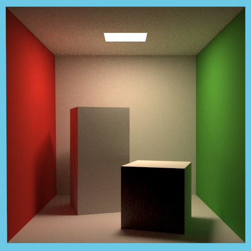
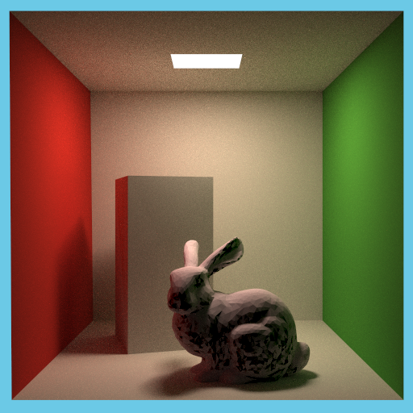

### Demo
SPP: 512

##### Notice: for MacBook Pro M1 users 
use Clang++ from other source (e.g. homebrew) for compile with -fopenmp flag instead of original Apple Clang (doesn't support for openmp yet)

#### Pitfalls
1. get_random_float: set dev, rng, dist as static variables. Otherwise, it would take a long time to render, for it may oftern return the same "random" number every time it's called
2. be careful and prevent objects from self-shadowing
3. floating point precision may cause misjudgement as occlusion
